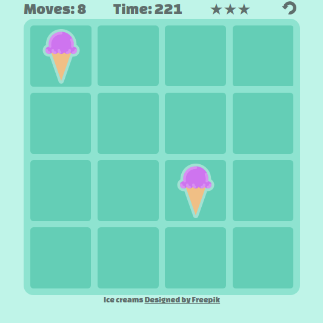

# An implementation of the card game concentration.

[Play the game here](https://hexaglot.github.io/pairs/)

This is a game of pairs implemented in HTML, CSS and JavaScript.

The game uses CSS grid to display the game board. As CSS grid is new to the CSS spec you need a modern browser. [Check browser support here](https://caniuse.com/#feat=css-grid) for more information.

CSS animations have been used to spice the game up a bit, theres also a loading and win screen to congratulate the player.

The graphics were taken from "http://www.freepik.com" and given the attribution
as asked for on that site.

Useful resources in implementing the card flip, and the ice cream animations at
the end. - https://desandro.github.io/3dtransforms/ https://estelle.github.io/cssmastery/

